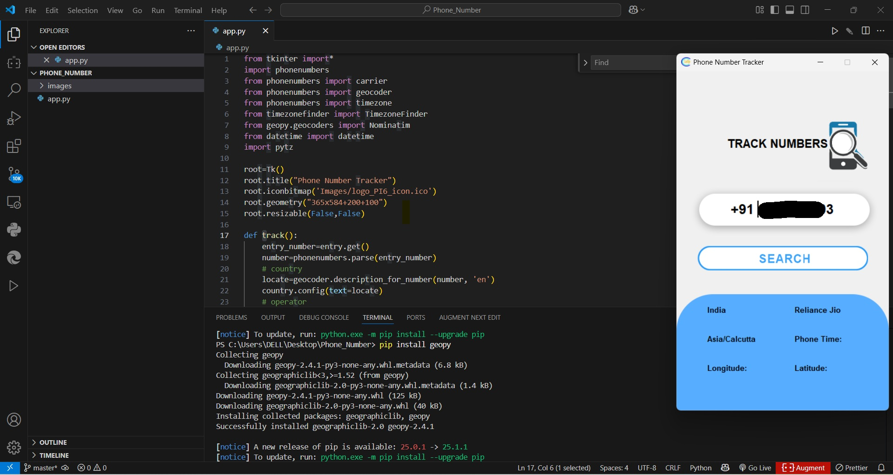

# 📱 Phone Number Tracker

A simple Python desktop application using Tkinter that allows users to track information about any valid phone number, including:
- Country
- SIM card operator
- Timezone
- Local time
- Longitude and Latitude

This app provides an intuitive and user-friendly interface to display all these details in a well-designed GUI.

---

## 🖼️ Demo Screenshot



---

## 🚀 Features

- Track country, service provider, and timezone from a phone number
- Display geographical coordinates (latitude and longitude)
- Show local time based on the phone number's location
- Built using Tkinter, Geopy, TimezoneFinder, and phonenumbers libraries

---

## 🔧 Requirements

Make sure Python is installed. Then, install the required packages using:

```bash
pip install phonenumbers geopy timezonefinder pytz


# 1. Clone the repository
git clone https://github.com/your-username/phone-number-tracker.git
cd phone-number-tracker

# 2. Ensure the folder structure:
#    phone-number-tracker/
#    ├── app.py
#    ├── Images/
#    │   ├── logo_PI6_icon.ico
#    │   ├── logoimage.png
#    │   ├── search.png
#    │   ├── search png.png
#    │   └── bottom png.png
#    ├── images/
#    │   └── screenshot-tracker1.jpg
#    └── README.md

# 3. Run the Python application
python app.py

